# 智校数据综合展示中心 — 数据库 ER 图（Chen's Notation）

> 本文档使用 **Graphviz DOT** 语法编写经典 Chen's Notation（陈式ER图）。
> - `ER图.dot`：实体关系图（不带属性），适合汇报展示，比较简洁
> - `ER图_完整.dot`：完整 ER 图（包含所有属性和关系属性），适合详细说明
> - 两张图都可直接用 image2 插件或 Graphviz 命令行渲染生成图片

---

## 一、实体关系图（不带属性）

这张图只包含**实体**和**关系**，不画属性椭圆，尺寸较小，适合在汇报中展示整体结构。

图片预览：`er-diagram.png`

DOT 代码如下：

```dot
digraph ER {
    graph [fontname="Microsoft YaHei", fontsize=12, rankdir=TB,
           bgcolor=white, margin=0, nodesep=0.45, ranksep=1.0];
    node [fontname="Microsoft YaHei", fontsize=11,
          shape=rectangle, style=filled, fillcolor="#f8f9fa",
          width=0, height=0, margin="0.18,0.10"];
    edge [fontname="Microsoft YaHei", fontsize=10,
          arrowhead=none, color="#333333"];

    /* ============================================================
       第一层：区域
       ============================================================ */
    Region [label="区域"];

    /* ============================================================
       第二层：学校、供应商、食材分类
       ============================================================ */
    { rank=same;
      School [label="学校"];
      Supplier [label="供应商"];
      IngCat [label="食材分类"];
    }

    /* ============================================================
       第三层：食堂、食材
       ============================================================ */
    { rank=same;
      Canteen [label="食堂"];
      Ingredient [label="食材"];
    }

    /* ============================================================
       第四层：采购订单、食材价格
       ============================================================ */
    { rank=same;
      Purchase [label="采购订单"];
      PriceRec [label="食材价格"];
    }

    /* ============================================================
       第五层：日管控、周排查、月调度
       ============================================================ */
    { rank=same;
      DailyCtrl [label="日管控"];
      WeeklyInsp [label="周排查"];
      MonthlyDisp [label="月调度"];
    }

    /* ============================================================
       第六层：订餐记录、食材验收、师生评价、管控明细
       ============================================================ */
    { rank=same;
      Order [label="订餐记录"];
      IngAccept [label="食材验收"];
      Evaluation [label="师生评价"];
      DCItem [label="管控明细"];
    }

    /* ============================================================
       第七层：学生营养、消费记录
       ============================================================ */
    { rank=same;
      StuNutri [label="学生营养"];
      Consump [label="消费记录"];
    }

    /* ============================================================
       关系定义
       ============================================================ */

    /* 区域 包含 学校 */
    R1 [shape=diamond, label="包含", fillcolor="#e3f2fd"];
    Region -> R1 [label="1", len=0.3];
    R1 -> School [label="n", len=0.3];

    /* 学校 拥有 食堂 */
    R2 [shape=diamond, label="拥有", fillcolor="#e3f2fd"];
    School -> R2 [label="1", len=0.3];
    R2 -> Canteen [label="n", len=0.3];

    /* 食材分类 分类 食材 */
    R3 [shape=diamond, label="分类", fillcolor="#e3f2fd"];
    IngCat -> R3 [label="1", len=0.3];
    R3 -> Ingredient [label="n", len=0.3];

    /* 三元关系：供应商 + 食堂 + 食材 供应 */
    R_supply [shape=diamond, label="供应", fillcolor="#e3f2fd"];
    Supplier -> R_supply [label="n", len=0.4];
    Canteen -> R_supply [label="n", len=0.4];
    R_supply -> Ingredient [label="m", len=0.4];

    /* 供应商 供货 采购订单 */
    R4 [shape=diamond, label="供货", fillcolor="#e3f2fd"];
    Supplier -> R4 [label="1", len=0.3];
    R4 -> Purchase [label="n", len=0.3];

    /* 食堂 产生 采购订单 */
    R5 [shape=diamond, label="产生", fillcolor="#e3f2fd"];
    Canteen -> R5 [label="1", len=0.3];
    R5 -> Purchase [label="n", len=0.3];

    /* 采购订单 采购 食材 */
    R_purchase [shape=diamond, label="采购", fillcolor="#e3f2fd"];
    Purchase -> R_purchase [label="n", len=0.3];
    R_purchase -> Ingredient [label="m", len=0.3];

    /* 食材 波动 食材价格 */
    R6 [shape=diamond, label="波动", fillcolor="#e3f2fd"];
    Ingredient -> R6 [label="1", len=0.3];
    R6 -> PriceRec [label="n", len=0.3];

    /* 学校/食堂 产生 日管控 */
    R7 [shape=diamond, label="产生", fillcolor="#e3f2fd"];
    School -> R7 [label="1", len=0.3];
    R7 -> DailyCtrl [label="n", len=0.3];

    R8 [shape=diamond, label="产生", fillcolor="#e3f2fd"];
    Canteen -> R8 [label="1", len=0.3];
    R8 -> DailyCtrl [label="n", len=0.3];

    /* 日管控 包含 管控明细 */
    R9 [shape=diamond, label="包含", fillcolor="#e3f2fd"];
    DailyCtrl -> R9 [label="1", len=0.3];
    R9 -> DCItem [label="n", len=0.3];

    /* 学校 产生 周排查 */
    R10 [shape=diamond, label="产生", fillcolor="#e3f2fd"];
    School -> R10 [label="1", len=0.3];
    R10 -> WeeklyInsp [label="n", len=0.3];

    /* 学校/食堂 产生 月调度 */
    R11 [shape=diamond, label="产生", fillcolor="#e3f2fd"];
    School -> R11 [label="1", len=0.3];
    R11 -> MonthlyDisp [label="n", len=0.3];

    R12 [shape=diamond, label="产生", fillcolor="#e3f2fd"];
    Canteen -> R12 [label="1", len=0.3];
    R12 -> MonthlyDisp [label="n", len=0.3];

    /* 学校/食堂 产生 订餐记录 */
    R13 [shape=diamond, label="产生", fillcolor="#e3f2fd"];
    School -> R13 [label="1", len=0.3];
    R13 -> Order [label="n", len=0.3];

    R14 [shape=diamond, label="产生", fillcolor="#e3f2fd"];
    Canteen -> R14 [label="1", len=0.3];
    R14 -> Order [label="n", len=0.3];

    /* 学校/食堂 产生 食材验收；食材 验收 食材验收 */
    R15 [shape=diamond, label="产生", fillcolor="#e3f2fd"];
    School -> R15 [label="1", len=0.3];
    R15 -> IngAccept [label="n", len=0.3];

    R16 [shape=diamond, label="产生", fillcolor="#e3f2fd"];
    Canteen -> R16 [label="1", len=0.3];
    R16 -> IngAccept [label="n", len=0.3];

    R17 [shape=diamond, label="验收", fillcolor="#e3f2fd"];
    Ingredient -> R17 [label="1", len=0.3];
    R17 -> IngAccept [label="n", len=0.3];

    /* 学校/食堂 产生 师生评价 */
    R18 [shape=diamond, label="产生", fillcolor="#e3f2fd"];
    School -> R18 [label="1", len=0.3];
    R18 -> Evaluation [label="n", len=0.3];

    R19 [shape=diamond, label="产生", fillcolor="#e3f2fd"];
    Canteen -> R19 [label="1", len=0.3];
    R19 -> Evaluation [label="n", len=0.3];

    /* 学校/食堂 产生 学生营养；食材 摄入 学生营养 */
    R20 [shape=diamond, label="产生", fillcolor="#e3f2fd"];
    School -> R20 [label="1", len=0.3];
    R20 -> StuNutri [label="n", len=0.3];

    R21 [shape=diamond, label="产生", fillcolor="#e3f2fd"];
    Canteen -> R21 [label="1", len=0.3];
    R21 -> StuNutri [label="n", len=0.3];

    R22 [shape=diamond, label="摄入", fillcolor="#e3f2fd"];
    Ingredient -> R22 [label="1", len=0.3];
    R22 -> StuNutri [label="n", len=0.3];

    /* 学校/食堂 产生 消费记录 */
    R23 [shape=diamond, label="产生", fillcolor="#e3f2fd"];
    School -> R23 [label="1", len=0.3];
    R23 -> Consump [label="n", len=0.3];

    R24 [shape=diamond, label="产生", fillcolor="#e3f2fd"];
    Canteen -> R24 [label="1", len=0.3];
    R24 -> Consump [label="n", len=0.3];
}

```



---

## 二、完整 ER 图（带属性）

这张图包含**实体**、**属性**、**关系**和**关系属性**，信息更完整，但尺寸较大，适合详细讲解或查看字段细节。

图片预览：`er-diagram-full.png`

DOT 代码见文件 `ER图_完整.dot`。

---

## 图例说明

| 符号 | 含义 |
|------|------|
| ▭ 矩形 | **实体**（表） |
| ◯ 实线椭圆 | **属性**（字段） |
| ◇ 菱形 | **关系**（实体间的关联） |
| ◯ 虚线椭圆 | **关系属性**（附加在关系上的字段） |
| 连线上的 **1 / n / m** | **基数**（一对一 / 一对多 / 多对多） |

---

## 核心关系汇总

### 1. 二元关系（1:n）

| 关系名 | 实体A | 基数 | 实体B | 说明 |
|--------|-------|------|-------|------|
| 包含 | 区域 | 1:n | 学校 | 一个区域包含多所学校 |
| 拥有 | 学校 | 1:n | 食堂 | 一所学校拥有多个食堂 |
| 分类 | 食材分类 | 1:n | 食材 | 一个分类下有多种食材 |
| 供货 | 供应商 | 1:n | 采购订单 | 一个供应商参与多次采购 |
| 产生 | 食堂 | 1:n | 采购订单 | 一个食堂产生多条采购记录 |
| 产生 | 学校 | 1:n | 日管控 | 一个学校产生多条日管控记录 |
| 产生 | 食堂 | 1:n | 日管控 | 一个食堂产生多条日管控记录 |
| 包含 | 日管控 | 1:n | 管控明细 | 一条管控记录包含多条检查项 |
| 产生 | 学校 | 1:n | 周排查 | 一个学校产生多条周排查记录 |
| 产生 | 学校 | 1:n | 月调度 | 一个学校产生多条月调度记录 |
| 产生 | 食堂 | 1:n | 月调度 | 一个食堂产生多条月调度记录 |
| 产生 | 学校 | 1:n | 订餐记录 | 一个学校产生多条订餐记录 |
| 产生 | 食堂 | 1:n | 订餐记录 | 一个食堂产生多条订餐记录 |
| 产生 | 学校 | 1:n | 食材验收 | 一个学校产生多条验收记录 |
| 产生 | 食堂 | 1:n | 食材验收 | 一个食堂产生多条验收记录 |
| 验收 | 食材 | 1:n | 食材验收 | 一种食材被验收多次 |
| 产生 | 学校 | 1:n | 师生评价 | 一个学校产生多条评价记录 |
| 产生 | 食堂 | 1:n | 师生评价 | 一个食堂产生多条评价记录 |
| 产生 | 学校 | 1:n | 学生营养 | 一个学校产生多条营养记录 |
| 产生 | 食堂 | 1:n | 学生营养 | 一个食堂产生多条营养记录 |
| 摄入 | 食材 | 1:n | 学生营养 | 一种食材对应多条营养记录 |
| 产生 | 学校 | 1:n | 消费记录 | 一个学校产生多条消费记录 |
| 产生 | 食堂 | 1:n | 消费记录 | 一个食堂产生多条消费记录 |
| 波动 | 食材 | 1:n | 食材价格 | 一种食材有多条价格记录 |

### 2. 三元关系

| 关系名 | 参与实体 | 关系属性 | 说明 |
|--------|----------|----------|------|
| 供应 | 供应商 + 食堂 + 食材 | 供应单价、是否主供 | 某个供应商向某个食堂供应某种食材 |

### 3. n:m 关系

| 关系名 | 参与实体 | 关系属性 | 说明 |
|--------|----------|----------|------|
| 采购 | 采购订单 + 食材 | 数量、单价、金额 | 一张采购订单包含多种食材 |

---

## 渲染方法

### 方法1：VS Code + image2 插件

1. 打开 `ER图.dot`（小图）或 `ER图_完整.dot`（完整图）
2. 按 `Ctrl+Shift+V`（或右键 → image2: Preview）即可预览
3. 右键图片选择 "Save Image" 保存为 PNG

### 方法2：Graphviz 命令行

```bash
# 生成小图（不带属性）
dot -Tpng ER图.dot -o er-diagram.png

# 生成完整图（带属性）
dot -Tpng ER图_完整.dot -o er-diagram-full.png
```

### 方法3：在线工具

- https://dreampuf.github.io/GraphvizOnline/
- https://edotor.net/

---

## 大屏板块与实体对应

| 大屏板块 | 来源实体 | 统计维度 |
|----------|----------|----------|
| 日管控情况汇总 | 日管控 + 管控明细 | 按日期统计排查/完成/待整改数量 |
| 采购总成本分析 | 采购订单 + 采购明细 | 按支付状态汇总金额 |
| 膳食经费数据分析 | 采购订单 | 按月统计采购总金额 |
| 订餐数据分析 | 订餐记录 | 按菜品/餐次统计订餐数量 |
| 区域数据分布 | 学校 + 订餐记录 | 按区域聚合订单数 |
| 食材单价波动分析 | 食材价格 | 按日期统计食材价格趋势 |
| 学生营养情况分析 | 学生营养 | 按营养类别统计摄入量 |
| 供应商评分分析 | 供应商 | 直接展示评分与评级 |
| 月调度情况汇总 | 月调度 | 按月展示调度列表 |
| 周排查情况汇总 | 周排查 | 统计排查/合格/问题数量 |
| 消费数据分析 | 消费记录 | 按月/区域统计消费金额 |
| 食材验收质量分析 | 食材验收 | 按质量状态统计合格率分布 |
| 师生评价情况分析 | 师生评价 | 按日期统计平均分、展示评价内容 |
