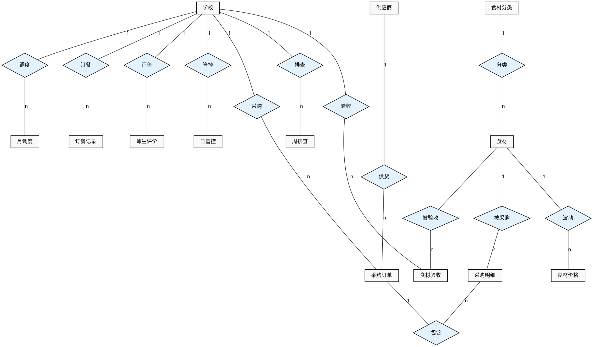

# 智校数据综合展示中心 — 数据库 ER 图（Chen's Notation）

> 本文档使用 **Graphviz DOT** 语法编写经典 Chen's Notation（陈式 ER 图）。
> - `ER图.dot`：实体关系图（不带属性），适合汇报展示，比较简洁
> - `ER图_完整.dot`：完整 ER 图（包含所有属性和关系属性），适合详细说明
> - 两张图都可直接用 image2 插件或 Graphviz 命令行渲染生成图片
> - **本版为简化版**：去掉区域、食堂、管控明细、学生营养、消费记录等独立实体，把区域和食堂信息收敛为学校属性，统计由现有实体聚合得到。

---

## 一、实体关系图（不带属性）

这张图只包含**实体**和**关系**，不画属性椭圆，尺寸较小，适合在汇报中展示整体结构。

图片预览：`er-diagram.png`

DOT 代码如下：



---

## 二、完整 ER 图（带属性）

这张图包含**实体**、**属性**、**关系**和**关系属性**，信息更完整，但尺寸较大，适合详细讲解或查看字段细节。

图片预览：`er-diagram-full.png`

DOT 代码见文件 `ER图_完整.dot`。

---

## 图例说明

| 符号 | 含义 |
|------|------|
| ▭ 矩形 | **实体**（表） |
| ◯ 实线椭圆 | **属性**（字段） |
| ◇ 菱形 | **关系**（实体间的关联） |
| ◯ 虚线椭圆 | **关系属性**（附加在关系上的字段） |
| 连线上的 **1 / n / m** | **基数**（一对一 / 一对多 / 多对多） |

---

## 核心关系汇总

| 关系名 | 实体A | 基数 | 实体B | 关系属性 | 说明 |
|--------|-------|------|-------|----------|------|
| 分类 | 食材分类 | 1:n | 食材 | — | 一个分类下有多种食材 |
| 采购 | 学校 | 1:n | 采购订单 | 采购日期 | 一所学校有多条采购记录 |
| 供货 | 供应商 | 1:n | 采购订单 | 供货日期 | 一个供应商参与多次采购 |
| 包含 | 采购订单 | 1:n | 采购明细 | 行号 | 一张订单包含多条明细 |
| 被采购 | 食材 | 1:n | 采购明细 | 数量、单价 | 一种食材被多次采购 |
| 波动 | 食材 | 1:n | 食材价格 | 记录日期 | 一种食材有多条价格记录 |
| 验收 | 学校 | 1:n | 食材验收 | 验收日期 | 学校对食材做质量验收 |
| 被验收 | 食材 | 1:n | 食材验收 | 数量、质量状态 | 一种食材被验收多次 |
| 管控 | 学校 | 1:n | 日管控 | 管控日期 | 学校每天产生管控记录 |
| 排查 | 学校 | 1:n | 周排查 | 排查周次 | 学校每周产生排查记录 |
| 调度 | 学校 | 1:n | 月调度 | 调度月份 | 学校每月产生调度记录 |
| 订餐 | 学校 | 1:n | 订餐记录 | 订餐日期 | 学校每天产生订餐数据 |
| 评价 | 学校 | 1:n | 师生评价 | 评价日期 | 学校收到师生评价 |

---

## 渲染方法

### 方法1：VS Code + image2 插件

1. 打开 `ER图.dot`（小图）或 `ER图_完整.dot`（完整图）
2. 按 `Ctrl+Shift+V`（或右键 → image2: Preview）即可预览
3. 右键图片选择 "Save Image" 保存为 PNG

### 方法2：Graphviz 命令行

```bash
# 生成小图（不带属性）
dot -Tpng ER图.dot -o er-diagram.png

# 生成完整图（带属性）
dot -Tpng ER图_完整.dot -o er-diagram-full.png
```

### 方法3：在线工具

- https://dreampuf.github.io/GraphvizOnline/
- https://edotor.net/

---

## 实体与字段总表

### 基础档案实体

| 实体 | 主键 | 主要属性 |
|------|------|----------|
| **学校** | 学校ID | 所属区域、学校名称、学校类型、学生人数、教师人数 |
| **供应商** | 供应商ID | 供应商名称、综合评分、评级、状态 |
| **食材分类** | 分类ID | 分类名称 |
| **食材** | 食材ID | 食材名称、规格、计量单位 |

### 业务记录实体

| 实体 | 主键 | 主要属性 |
|------|------|----------|
| **采购订单** | 采购ID | 订单编号、采购日期、总金额、支付状态 |
| **采购明细** | 明细ID | 采购ID、食材ID、数量、单价、金额 |
| **食材价格** | 记录ID | 食材ID、记录日期、价格 |
| **食材验收** | 验收ID | 学校ID、食材ID、验收日期、数量、质量状态、合格率 |
| **日管控** | 管控ID | 学校ID、管控日期、排查总数、已完成、待整改、状态 |
| **周排查** | 排查ID | 学校ID、排查周次、排查总数、合格数、合格率 |
| **月调度** | 调度ID | 学校ID、月份、调度名称、状态 |
| **订餐记录** | 订餐ID | 学校ID、订餐日期、餐次、学生订餐数、教师订餐数、总金额 |
| **师生评价** | 评价ID | 学校ID、评价日期、评价者类型、评分、评价内容 |

---

## 大屏板块与实体对应

| 大屏板块 | 来源实体 | 统计维度 |
|----------|----------|----------|
| 日管控情况汇总 | 日管控 | 按日期统计排查/完成/待整改数量 |
| 采购总成本分析 | 采购订单 + 采购明细 | 按支付状态汇总金额 |
| 膳食经费数据分析 | 采购订单 | 按月统计采购总金额 |
| 订餐数据分析 | 订餐记录 | 按菜品/餐次统计订餐数量 |
| 区域数据分布 | 学校 + 订餐记录 | 按区域聚合订单数 |
| 食材单价波动分析 | 食材价格 | 按日期统计食材价格趋势 |
| 学生营养情况分析 | 食材分类 | 按分类统计营养结构 |
| 供应商评分分析 | 供应商 | 直接展示评分与评级 |
| 月调度情况汇总 | 月调度 | 按月展示调度列表 |
| 周排查情况汇总 | 周排查 | 统计排查/合格/问题数量 |
| 消费数据分析 | 订餐记录 | 按月/区域统计消费金额 |
| 食材验收质量分析 | 食材验收 | 按质量状态统计合格率分布 |
| 师生评价情况分析 | 师生评价 | 按日期统计平均分、展示评价内容 |

---

## 简化说明

本次 ER 图从原来的 18 个实体精简为 **13 个实体**，主要做了以下合并/删除：

1. **区域** 不再作为独立实体，把`所属区域`收敛到**学校**属性中，区域统计直接按学校属性聚合。
2. **食堂** 不再作为独立实体，食堂相关字段收敛到**学校**属性中（或按学校维度整体统计）。
3. **管控明细** 删除，日管控的检查项直接作为日管控实体的统计字段（排查总数、已完成、待整改）。
4. **消费记录** 删除，月度消费数据由**订餐记录**按月份聚合得到。
5. **学生营养** 删除，营养结构分析由**食材分类**聚合得到。
6. 去掉三元关系和复杂的 n:m 关系，统一用**采购明细**表达采购订单与食材的关联。

简化后，关系数量从原来的 24 个减少到 **13 个**，ER 图结构更清晰，汇报时更容易讲解。
