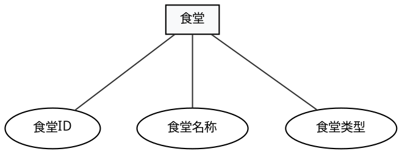
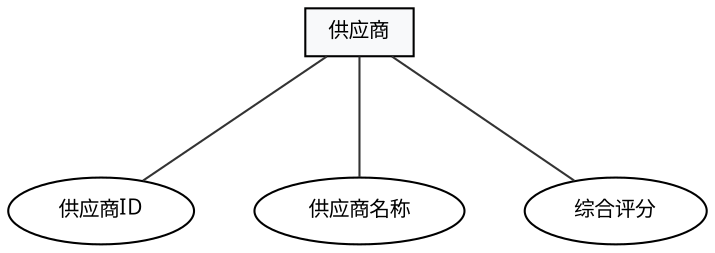
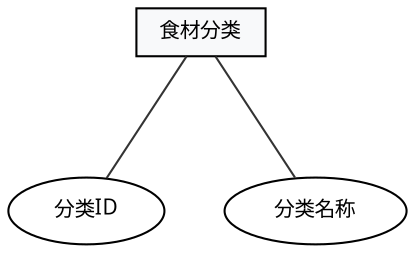
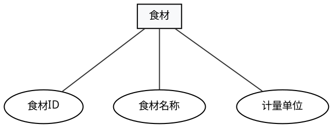
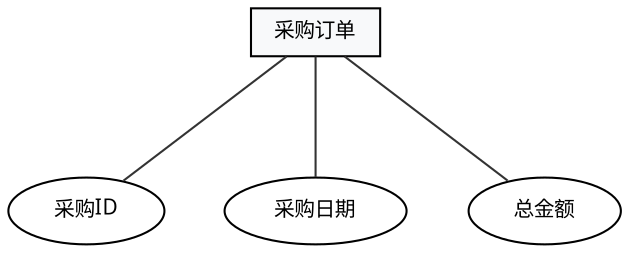
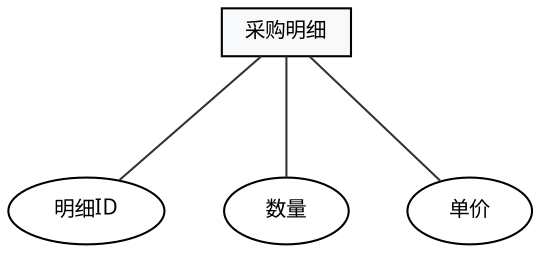
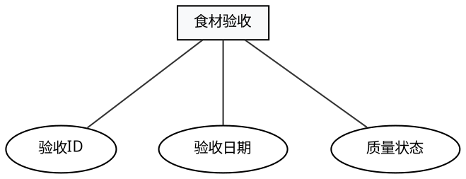

# 智校数据综合展示中心 — 各实体独立属性图

> 本文档为每个实体单独生成一张 ER 子图，只显示该实体及其属性，不显示关系。用于汇报时逐个介绍实体字段。
> 不包含**区域**和**学校**实体。

---

## 渲染方法

每张图都可以单独保存为 `.dot` 文件后渲染：

```bash
dot -Tpng 食堂.dot -o 食堂.png
```

或者在 VS Code 中安装 image2 插件，按 `Ctrl+Shift+V` 预览。

---

## 1. 食堂



---

## 2. 供应商



---
## 3. 食材分类



---

## 4. 食材



---

## 5. 采购订单



---

## 6. 采购明细



---

## 7. 食材验收



---

## 批量渲染脚本

把上面的代码分别保存为 `食堂.dot`、`供应商.dot`、`食材分类.dot`、`食材.dot`、`采购订单.dot`、`采购明细.dot`、`食材验收.dot`，然后运行：

```bash
for f in 食堂 供应商 食材分类 食材 采购订单 采购明细 食材验收; do
    dot -Tpng "$f.dot" -o "$f.png"
done
```
