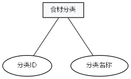
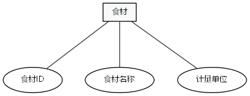
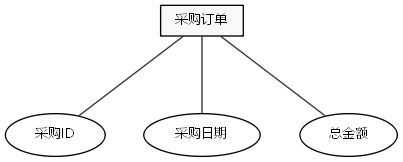
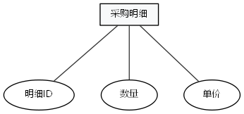
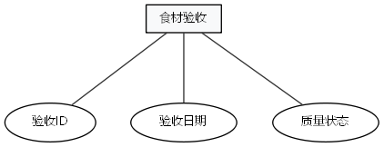
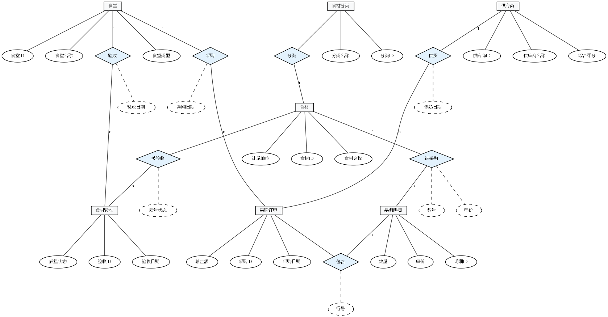

# 校园食堂智慧数据管理系统 — 需求文档

> 本文档依据《需求文档结构.md》的框架编写，适用于数据库课程大作业。系统以"校园食堂智慧监管"为业务背景，核心功能覆盖食堂档案、供应商管理、食材管理、采购管理、食材验收等业务数据的增删改查。

---

## 一、项目概述

### 1. 项目背景

随着高校后勤管理信息化水平的不断提升，传统的人工记录方式已经难以满足校园食堂日常运营管理的需求。食堂采购、食材验收、供应商评价等业务数据分散、统计困难，管理人员难以实时掌握食堂运营状况。

本项目以"智校数据综合展示中心"为背景，设计并实现一套**校园食堂智慧数据管理系统**。系统旨在将食堂运营过程中的核心数据进行规范化、程序化、科学化管理，打破信息孤岛，提升食材采购与验收管理的效率，为食堂管理者提供准确、实时的数据支撑。

### 2. 系统说明

**系统定位**：面向校园食堂后勤管理人员的数据管理系统，用于管理食堂、供应商、食材、采购订单、采购明细及食材验收等核心数据。

**核心价值**：
- 实现食堂基础档案、供应商、食材的统一管理；
- 支持采购订单与采购明细的录入、查询、修改、删除；
- 支持食材验收记录的管理与质量状态统计；
- 满足课程大作业对 Web 应用系统增删改查及现场演示的要求。

**用户角色**：

| 角色 | 权限 |
|------|------|
| 系统管理员 | 所有模块的增删改查权限 |
| 普通用户 | 查看数据、录入数据，无删除权限 |

**开发工具**：MySQL 8.0 数据库 + Python 3.x + PyMySQL 库（也可采用 PHP/Java 等其他 Web 开发方式）。

---

## 二、需求分析

### 2.1 系统需求

从校园食堂运营管理角度，系统需要满足以下核心需求：

1. **食堂档案管理**：对食堂基础信息进行维护，包括食堂名称、食堂类型等。
2. **供应商管理**：维护供应商信息，记录供应商名称、综合评分等。
3. **食材分类与食材管理**：对食材进行分类管理，并维护具体食材信息。
4. **采购全流程管理**：记录采购订单及其明细，支持按订单、按食材查询。
5. **食材验收管理**：记录每次食材到货后的验收情况，包括验收日期、质量状态等。
6. **数据统计**：支持按食堂、供应商、食材等维度进行基础统计。

### 2.2 数据需求

系统需要对以下六大类核心数据进行增删改查管理：

| 数据类型 | 说明 |
|----------|------|
| 食堂信息 | 食堂基础档案数据 |
| 供应商信息 | 供应商基础档案及评分数据 |
| 食材分类信息 | 食材分类目录数据 |
| 食材信息 | 具体食材档案数据 |
| 采购信息 | 采购订单及采购明细数据 |
| 食材验收信息 | 食材到货验收记录数据 |

### 2.3 数据字典（核心数据表定义）

数据字典是全文核心数据规范，定义系统全部 **7 张数据表**的含义、组成字段，统一字段数据类型、长度、取值范围，是数据库建表的核心依据。

#### 1. 食堂信息表（canteens）

存储食堂基础档案信息。

| 字段名 | 类型 | 约束 | 说明 |
|--------|------|------|------|
| id | INT | PK, AUTO_INCREMENT | 食堂ID |
| canteen_name | VARCHAR(100) | NOT NULL | 食堂名称 |
| canteen_type | VARCHAR(20) | | 食堂类型（自营/外包） |
| created_at | DATETIME | DEFAULT CURRENT_TIMESTAMP | 创建时间 |

#### 2. 供应商信息表（suppliers）

存储食材供应商信息。

| 字段名 | 类型 | 约束 | 说明 |
|--------|------|------|------|
| id | INT | PK, AUTO_INCREMENT | 供应商ID |
| supplier_name | VARCHAR(100) | NOT NULL | 供应商名称 |
| score | DECIMAL(4,2) | DEFAULT 0.00 | 综合评分（0-100） |
| created_at | DATETIME | DEFAULT CURRENT_TIMESTAMP | 创建时间 |

#### 3. 食材分类表（ingredient_categories）

存储食材分类信息。

| 字段名 | 类型 | 约束 | 说明 |
|--------|------|------|------|
| id | INT | PK, AUTO_INCREMENT | 分类ID |
| category_name | VARCHAR(50) | NOT NULL | 分类名称 |
| created_at | DATETIME | DEFAULT CURRENT_TIMESTAMP | 创建时间 |

#### 4. 食材信息表（ingredients）

存储具体食材信息。

| 字段名 | 类型 | 约束 | 说明 |
|--------|------|------|------|
| id | INT | PK, AUTO_INCREMENT | 食材ID |
| ingredient_name | VARCHAR(100) | NOT NULL | 食材名称 |
| category_id | INT | FK | 所属分类ID |
| unit | VARCHAR(20) | DEFAULT 'kg' | 计量单位 |
| created_at | DATETIME | DEFAULT CURRENT_TIMESTAMP | 创建时间 |

#### 5. 采购订单表（purchases）

存储采购订单主信息。

| 字段名 | 类型 | 约束 | 说明 |
|--------|------|------|------|
| id | INT | PK, AUTO_INCREMENT | 采购ID |
| canteen_id | INT | FK, NOT NULL | 食堂ID |
| supplier_id | INT | FK | 供应商ID |
| purchase_date | DATE | NOT NULL | 采购日期 |
| total_amount | DECIMAL(12,2) | DEFAULT 0.00 | 采购总金额（元） |
| created_at | DATETIME | DEFAULT CURRENT_TIMESTAMP | 创建时间 |

#### 6. 采购明细表（purchase_items）

存储采购订单明细。

| 字段名 | 类型 | 约束 | 说明 |
|--------|------|------|------|
| id | INT | PK, AUTO_INCREMENT | 明细ID |
| purchase_id | INT | FK, NOT NULL | 采购订单ID |
| ingredient_id | INT | FK, NOT NULL | 食材ID |
| quantity | DECIMAL(10,2) | NOT NULL | 采购数量 |
| unit_price | DECIMAL(10,2) | NOT NULL | 单价（元） |
| created_at | DATETIME | DEFAULT CURRENT_TIMESTAMP | 创建时间 |

#### 7. 食材验收表（ingredient_acceptances）

存储食材验收质量数据。

| 字段名 | 类型 | 约束 | 说明 |
|--------|------|------|------|
| id | INT | PK, AUTO_INCREMENT | 验收ID |
| canteen_id | INT | FK, NOT NULL | 食堂ID |
| ingredient_id | INT | FK, NOT NULL | 食材ID |
| acceptance_date | DATE | NOT NULL | 验收日期 |
| quality_status | TINYINT | DEFAULT 1 | 质量状态：0不合格，1合格，2优良 |
| created_at | DATETIME | DEFAULT CURRENT_TIMESTAMP | 创建时间 |

---

## 三、数据库设计

### 3.1 概念结构设计

基于需求分析搭建系统概念模型，设计 **7 张单实体 E-R 图 + 1 张系统整体 E-R 图**。7 张单实体 E-R 图分别对应食堂、供应商、食材分类、食材、采购订单、采购明细、食材验收 7 个实体，详见 `docs/ER图_各实体属性.md`；系统整体 E-R 图详见 `docs/ER图_完整.dot`。

#### 3.1.1 系统整体 E-R 图

根据需求分析，画出如下系统整体 E-R 图，展示各实体之间的关系：

<div align="center">


<small>图3-1 食堂实体E-R图</small>


<small>图3-2 供应商实体E-R图</small>


<small>图3-3 食材分类实体E-R图</small>


<small>图3-4 食材实体E-R图</small>


<small>图3-5 采购订单实体E-R图</small>


<small>图3-6 采购明细实体E-R图</small>


<small>图3-7 食材验收实体E-R图</small>


<small>图3-8 系统整体E-R图</small>

</div>


### 3.2 逻辑结构设计

#### 3.2.1 关系模型

将 E-R 概念模型转换为关系模型，得到以下关系：

1. **食堂**（食堂ID，食堂名称，食堂类型）
2. **供应商**（供应商ID，供应商名称，综合评分）
3. **食材分类**（分类ID，分类名称）
4. **食材**（食材ID，分类ID，食材名称，计量单位）
5. **采购订单**（采购ID，食堂ID，供应商ID，采购日期，总金额）
6. **采购明细**（明细ID，采购ID，食材ID，数量，单价）
7. **食材验收**（验收ID，食堂ID，食材ID，验收日期，质量状态）

#### 3.2.2 细化表结构

下表给出每张表的英文字段名、数据类型、主键、外键及非空约束，为 SQL 建表提供标准规范。

| 表名 | 字段名 | 数据类型 | 主键 | 外键 | 非空 | 说明 |
|------|--------|----------|------|------|------|------|
| canteens | id | INT | PK | — | 是 | 食堂ID |
| canteens | canteen_name | VARCHAR(100) | — | — | 是 | 食堂名称 |
| canteens | canteen_type | VARCHAR(20) | — | — | 否 | 食堂类型 |
| suppliers | id | INT | PK | — | 是 | 供应商ID |
| suppliers | supplier_name | VARCHAR(100) | — | — | 是 | 供应商名称 |
| suppliers | score | DECIMAL(4,2) | — | — | 否 | 综合评分 |
| ingredient_categories | id | INT | PK | — | 是 | 分类ID |
| ingredient_categories | category_name | VARCHAR(50) | — | — | 是 | 分类名称 |
| ingredients | id | INT | PK | — | 是 | 食材ID |
| ingredients | ingredient_name | VARCHAR(100) | — | — | 是 | 食材名称 |
| ingredients | category_id | INT | — | FK | 否 | 分类ID |
| ingredients | unit | VARCHAR(20) | — | — | 否 | 计量单位 |
| purchases | id | INT | PK | — | 是 | 采购ID |
| purchases | canteen_id | INT | — | FK | 是 | 食堂ID |
| purchases | supplier_id | INT | — | FK | 否 | 供应商ID |
| purchases | purchase_date | DATE | — | — | 是 | 采购日期 |
| purchases | total_amount | DECIMAL(12,2) | — | — | 否 | 总金额 |
| purchase_items | id | INT | PK | — | 是 | 明细ID |
| purchase_items | purchase_id | INT | — | FK | 是 | 采购订单ID |
| purchase_items | ingredient_id | INT | — | FK | 是 | 食材ID |
| purchase_items | quantity | DECIMAL(10,2) | — | — | 是 | 数量 |
| purchase_items | unit_price | DECIMAL(10,2) | — | — | 是 | 单价 |
| ingredient_acceptances | id | INT | PK | — | 是 | 验收ID |
| ingredient_acceptances | canteen_id | INT | — | FK | 是 | 食堂ID |
| ingredient_acceptances | ingredient_id | INT | — | FK | 是 | 食材ID |
| ingredient_acceptances | acceptance_date | DATE | — | — | 是 | 验收日期 |
| ingredient_acceptances | quality_status | TINYINT | — | — | 否 | 质量状态 |

---

## 四、数据库实施

### 3.3.1 数据库建表语句

```sql
-- 创建数据库
CREATE DATABASE IF NOT EXISTS campus_canteen DEFAULT CHARACTER SET utf8mb4 COLLATE utf8mb4_unicode_ci;
USE campus_canteen;

-- 1. 食堂信息表
CREATE TABLE canteens (
    id INT PRIMARY KEY AUTO_INCREMENT COMMENT '食堂ID',
    canteen_name VARCHAR(100) NOT NULL COMMENT '食堂名称',
    canteen_type VARCHAR(20) COMMENT '食堂类型（自营/外包）',
    created_at DATETIME DEFAULT CURRENT_TIMESTAMP COMMENT '创建时间'
) COMMENT='食堂信息表';

-- 2. 供应商信息表
CREATE TABLE suppliers (
    id INT PRIMARY KEY AUTO_INCREMENT COMMENT '供应商ID',
    supplier_name VARCHAR(100) NOT NULL COMMENT '供应商名称',
    score DECIMAL(4,2) DEFAULT 0.00 COMMENT '综合评分（0-100）',
    created_at DATETIME DEFAULT CURRENT_TIMESTAMP COMMENT '创建时间'
) COMMENT='供应商信息表';

-- 3. 食材分类表
CREATE TABLE ingredient_categories (
    id INT PRIMARY KEY AUTO_INCREMENT COMMENT '分类ID',
    category_name VARCHAR(50) NOT NULL COMMENT '分类名称',
    created_at DATETIME DEFAULT CURRENT_TIMESTAMP COMMENT '创建时间'
) COMMENT='食材分类表';

-- 4. 食材信息表
CREATE TABLE ingredients (
    id INT PRIMARY KEY AUTO_INCREMENT COMMENT '食材ID',
    ingredient_name VARCHAR(100) NOT NULL COMMENT '食材名称',
    category_id INT COMMENT '所属分类ID',
    unit VARCHAR(20) DEFAULT 'kg' COMMENT '计量单位',
    created_at DATETIME DEFAULT CURRENT_TIMESTAMP COMMENT '创建时间',
    FOREIGN KEY (category_id) REFERENCES ingredient_categories(id)
) COMMENT='食材信息表';

-- 5. 采购订单表
CREATE TABLE purchases (
    id INT PRIMARY KEY AUTO_INCREMENT COMMENT '采购ID',
    canteen_id INT NOT NULL COMMENT '食堂ID',
    supplier_id INT COMMENT '供应商ID',
    purchase_date DATE NOT NULL COMMENT '采购日期',
    total_amount DECIMAL(12,2) DEFAULT 0.00 COMMENT '采购总金额（元）',
    created_at DATETIME DEFAULT CURRENT_TIMESTAMP COMMENT '创建时间',
    FOREIGN KEY (canteen_id) REFERENCES canteens(id),
    FOREIGN KEY (supplier_id) REFERENCES suppliers(id)
) COMMENT='采购订单表';

-- 6. 采购明细表
CREATE TABLE purchase_items (
    id INT PRIMARY KEY AUTO_INCREMENT COMMENT '明细ID',
    purchase_id INT NOT NULL COMMENT '采购订单ID',
    ingredient_id INT NOT NULL COMMENT '食材ID',
    quantity DECIMAL(10,2) NOT NULL COMMENT '采购数量',
    unit_price DECIMAL(10,2) NOT NULL COMMENT '单价（元）',
    created_at DATETIME DEFAULT CURRENT_TIMESTAMP COMMENT '创建时间',
    FOREIGN KEY (purchase_id) REFERENCES purchases(id),
    FOREIGN KEY (ingredient_id) REFERENCES ingredients(id)
) COMMENT='采购明细表';

-- 7. 食材验收表
CREATE TABLE ingredient_acceptances (
    id INT PRIMARY KEY AUTO_INCREMENT COMMENT '验收ID',
    canteen_id INT NOT NULL COMMENT '食堂ID',
    ingredient_id INT NOT NULL COMMENT '食材ID',
    acceptance_date DATE NOT NULL COMMENT '验收日期',
    quality_status TINYINT DEFAULT 1 COMMENT '质量状态：0不合格，1合格，2优良',
    created_at DATETIME DEFAULT CURRENT_TIMESTAMP COMMENT '创建时间',
    FOREIGN KEY (canteen_id) REFERENCES canteens(id),
    FOREIGN KEY (ingredient_id) REFERENCES ingredients(id)
) COMMENT='食材验收表';
```

### 3.4 项目代码实现

以下采用 **Python + PyMySQL** 实现食材信息表的完整业务功能：数据新增、删除、修改、多表查询、数据展示、系统退出。代码贴合课程设计写实要求，同时标注了存在的安全漏洞。

```python
# db.py：数据库连接配置
import pymysql

def get_conn():
    return pymysql.connect(
        host='localhost',
        user='root',
        password='123456',
        database='campus_canteen',
        charset='utf8mb4'
    )
```

```python
# ingredient_dao.py：食材信息数据访问层
import pymysql
from db import get_conn

def list_ingredients():
    """多表查询：查询食材及其分类信息"""
    conn = get_conn()
    try:
        with conn.cursor(pymysql.cursors.DictCursor) as cursor:
            sql = """
                SELECT i.id, i.ingredient_name, c.category_name, i.unit
                FROM ingredients i
                LEFT JOIN ingredient_categories c ON i.category_id = c.id
            """
            cursor.execute(sql)
            return cursor.fetchall()
    finally:
        conn.close()

def add_ingredient(name, category_id, unit):
    """新增食材"""
    conn = get_conn()
    try:
        with conn.cursor() as cursor:
            sql = "INSERT INTO ingredients (ingredient_name, category_id, unit) VALUES (%s, %s, %s)"
            cursor.execute(sql, (name, category_id, unit))
            conn.commit()
            return cursor.rowcount
    finally:
        conn.close()

def update_ingredient(ing_id, name, category_id, unit):
    """修改食材"""
    conn = get_conn()
    try:
        with conn.cursor() as cursor:
            sql = "UPDATE ingredients SET ingredient_name=%s, category_id=%s, unit=%s WHERE id=%s"
            cursor.execute(sql, (name, category_id, unit, ing_id))
            conn.commit()
            return cursor.rowcount
    finally:
        conn.close()

def delete_ingredient(ing_id):
    """删除食材"""
    conn = get_conn()
    try:
        with conn.cursor() as cursor:
            sql = "DELETE FROM ingredients WHERE id=%s"
            cursor.execute(sql, (ing_id,))
            conn.commit()
            return cursor.rowcount
    finally:
        conn.close()
```

```python
# main.py：简单命令行菜单，演示增删改查
from ingredient_dao import list_ingredients, add_ingredient, update_ingredient, delete_ingredient

def show_menu():
    print("\n===== 校园食堂智慧数据管理系统 =====")
    print("1. 查看食材列表")
    print("2. 新增食材")
    print("3. 修改食材")
    print("4. 删除食材")
    print("0. 退出系统")
    print("====================================")

def show_ingredients():
    rows = list_ingredients()
    print("\n食材列表：")
    print("ID\t名称\t\t分类\t\t单位")
    for row in rows:
        print(f"{row['id']}\t{row['ingredient_name']}\t\t{row['category_name']}\t\t{row['unit']}")

def main():
    while True:
        show_menu()
        choice = input("请选择操作：").strip()
        if choice == '1':
            show_ingredients()
        elif choice == '2':
            name = input("请输入食材名称：")
            category_id = input("请输入分类ID：")
            unit = input("请输入计量单位：")
            add_ingredient(name, category_id, unit)
            print("新增成功")
        elif choice == '3':
            ing_id = input("请输入食材ID：")
            name = input("请输入新的食材名称：")
            category_id = input("请输入新的分类ID：")
            unit = input("请输入新的计量单位：")
            update_ingredient(ing_id, name, category_id, unit)
            print("修改成功")
        elif choice == '4':
            ing_id = input("请输入要删除的食材ID：")
            delete_ingredient(ing_id)
            print("删除成功")
        elif choice == '0':
            print("系统退出")
            break
        else:
            print("无效选择，请重新输入")

if __name__ == '__main__':
    main()
```

#### 代码说明与风险提示

| 项目 | 说明 |
|------|------|
| 已实现功能 | 食材信息的增、删、改、查、展示、系统退出 |
| 多表查询 | `list_ingredients()` 通过 LEFT JOIN 关联 `ingredients` 和 `ingredient_categories` 表 |
| 已知漏洞 | 命令行菜单直接使用用户输入，未做输入类型校验和异常处理；虽已使用 PyMySQL 参数化查询避免 SQL 注入，但仍存在输入格式错误导致的程序异常 |
| 改进建议 | 生产环境应增加输入校验、异常捕获、日志记录和权限控制 |

---

## 五、实验报告材料清单

根据大作业要求，最终需提交以下材料：

| 材料 | 文件名/位置 |
|------|------------|
| 需求文档 | docs/需求文档.md |
| 数据库设计文档 | docs/database_design.md |
| ER 图 | docs/ER图.dot、docs/ER图_完整.dot |
| 关系模式 | docs/关系模式.md |
| 测试用例 | tests/test_cases.md |
| 演示 PPT | 自行准备 |
| 源码 | 项目根目录 |

---

## 六、总结

本文档按照标准数据库课程设计流程，从项目背景、需求分析、数据库设计到数据库实施，完整描述了校园食堂智慧数据管理系统的设计过程。系统以食堂为中心，围绕供应商、食材、采购、验收等核心业务设计 7 张数据表，结构清晰，关系明确，满足课程大作业对 Web 应用系统数据库设计的要求。
